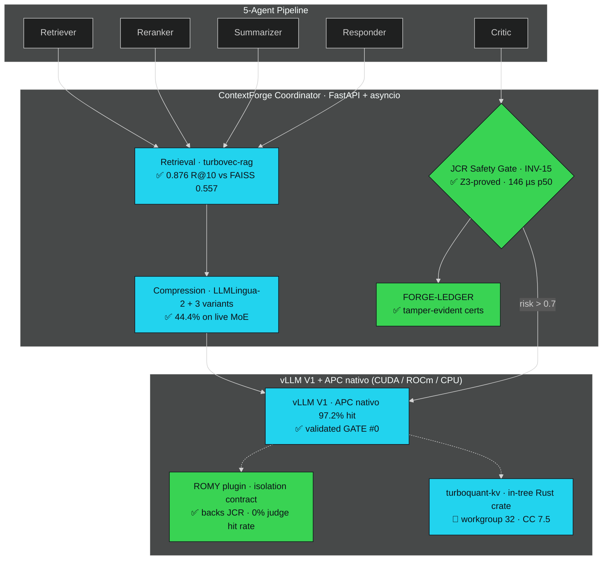

<p align="center">
  
</p>

<h1 align="center">APOHARA&nbsp;·&nbsp;ContextForge</h1>

<p align="center">
  <strong>Provably-safe multi-agent LLM inference, hardware-agnostic by construction.</strong><br>
  Three orthogonal compression layers · ROMY isolation contract · Z3-proved INV-15 · honest by construction.<br>
  <sub>Validated on AMD MI300X · runs on any CUDA/ROCm/CPU · Apache 2.0.</sub>
</p>

<p align="center">
  <a href="https://doi.org/10.5281/zenodo.20412807"></a>
  <a href="#-proof-not-promises"></a>
  <a href="paper/inv15_paper.pdf"></a>
</p>
<p align="center">
  <a href="https://pypi.org/project/apohara-context-forge/"></a>
  <a href="#-verification"></a>
  <a href="AUDIT.md"></a>
  <a href="LICENSE"></a>
</p>

<p align="center">
  <a href="#-the-judge-is-the-agent-cache-reuse-corrupts">Problem</a>&nbsp;·&nbsp;
  <a href="#-proof-not-promises"><b>Proof</b></a>&nbsp;·&nbsp;
  <a href="#-apohara-2.0-the-platform">Apohara 2.0</a>&nbsp;·&nbsp;
  <a href="#-architecture">Architecture</a>&nbsp;·&nbsp;
  <a href="#-quick-start">Quick start</a>&nbsp;·&nbsp;
  <a href="#-who-needs-this">Who needs this</a>&nbsp;·&nbsp;
  <a href="#-honest-by-construction"><b>Honesty</b></a>&nbsp;·&nbsp;
  <a href="#-cite">Cite</a>
</p>

---

## 🎯 The judge is the agent cache-reuse corrupts

Serious AI in 2026 is built from **multi-agent pipelines** — retriever → reranker → summarizer → **critic** → responder. Every agent re-reads the same long context, so the obvious way to make them affordable is to **share the KV-cache** across agents.

**That quietly breaks the one agent you trust most — the judge.** When a Critic compares candidates, reused attention from a prior ranking encodes the *old* ordering and biases the new verdict. Accuracy on everything else still looks fine, so the corruption is **invisible** ([Liang et al., 2026](https://arxiv.org/abs/2601.08343)). Teams are left with two bad options: burn GPU re-computing everything, or ship judges that silently lie.

**ContextForge is the layer that proves when reuse is safe** — and serves frontier models on a 192 GB MI300X or on an 8 GB RTX 2060 SUPER. The platform is **hardware-agnostic by construction** ([Apohara 2.0](#-apohara-2.0-the-platform)): every compression layer is independent and any combination runs on any hardware that supports the vLLM/SGLang inference backend.

---

## Apohara 2.0 — the platform

**Three orthogonal compression layers** (retrieval index, prompt tokens, KV cache) on top of the V6.2.0 serving + safety + observability substrate. Each layer is **hardware-agnostic** and ships with its own honest-scope notes. ROMY is the **isolation contract** that backs INV-15 — not a memory-optimizer (post-ABANDON reframe; see [LMCACHE.md](LMCACHE.md)).

The platform is **the result of a deliberate pivot from the mechanical KV-sharing hypothesis** that GATE #0 preregistered-out ([log](logs/gate0/)). Sharing at the attention level loses to vLLM's native APC (−22% throughput). The **durable, arch-agnostic wins are compression** — and Apohara 2.0 ships them as three independent, swappable layers.

| Layer | Status | What it is, honestly | Evidence |
|---|---|---|---|
| **turbovec-rag** | 🟢 GREEN ([AUDIT #23a](AUDIT.md) · #27a) | RAG retriever backed by Turbovec (TurboQuant ANN, Rust+Python). Recall parity **0.876 vs 0.557** FAISS-IVF on HotpotQA-200. **RAM-ceiling 4 GB @ 10M / 768-d met via per-block codec** (`group_size=256`): **3,815 MiB** measured (codes 3,662 + scales 120 + zps 120 + norms 38). The back-compat `group_size=1` path still projects to 62,294 MiB — pinned as the honest gap. | [`apohara_context_forge/retrieval/`](apohara_context_forge/retrieval/) · [`apohara_context_forge/quantization/codec_v8.py`](apohara_context_forge/quantization/codec_v8.py) · [`benchmarks/apohara2/bench_ann.py`](apohara_context_forge/benchmarks/apohara2/bench_ann.py) |
| **llmlingua2-extend** | 🟡 PARTIAL ([AUDIT #28](AUDIT.md)) | 3 LLMLingua-2 variants with auto-select (≤512 / ≤2K / >2K), M3 judge with greedy decoding (`temperature=0`, `top_p=1.0`, `top_k=1`), PPL-delta ≤ 5% threshold wired. **Real `_real_downstream_ppl` on qwen3-1.7b** shipped (Sprint 3, AUDIT #28) — opt-in via `LLMLINGUA_REAL=1`; the synthetic `STUB_DOWNSTREAM_PPL=12.5` is gone, replaced by a tagged `_STUB_RATIO=0.55` sentinel for failure paths. | [`apohara_context_forge/compression/compressor.py`](apohara_context_forge/compression/compressor.py) · [`apohara_context_forge/eval/`](apohara_context_forge/eval/) · [`benchmarks/apohara2/bench_compress.py`](apohara_context_forge/benchmarks/apohara2/bench_compress.py) |
| **turboquant-kv-upstream** | 🟡 PARTIAL ([AUDIT #320a](AUDIT.md)) | In-tree `turboquant-turing` Rust crate, CC 7.5 port + workgroup 32 (vectorised Lloyd-Max + 1-bit QJL, re-derived from [arXiv:2504.19874](https://arxiv.org/abs/2504.19874), ICLR 2026). **PyO3 bindings wired** (Sprint 2): `fwht_inplace` and `dequant_per_block` exposed via `#[pymodule]`, gated by `importlib.util.find_spec` so the Python path falls back to numpy/torch when the wheel is absent. The `.cu` kernel and a real `cargo test --release` run remain build-time — the Rust crate is parseable, maturin-ready, and tagged honestly in AUDIT #320a. | [`apohara_context_forge/serving/turboquant_kv.py`](apohara_context_forge/serving/turboquant_kv.py) · [`apohara_context_forge/serving/turboquant_turing/`](apohara_context_forge/serving/turboquant_turing/) · [`apohara_context_forge/quantization/codec_v8.py`](apohara_context_forge/quantization/codec_v8.py) · [`benchmarks/apohara2/bench_kv.py`](apohara_context_forge/benchmarks/apohara2/bench_kv.py) |

**ROMY reconciliation (US-007 / Phase 5, [AUDIT #21](AUDIT.md)).** The `cache_salt` plane stays. The "memory-optimizer" framing is dead (GATE #0 ABANDON, −22% throughput, +147% TTFT vs APC alone). ROMY is the **isolation contract** that backs INV-15: judges get a unique salt → vLLM allocates fresh blocks → **0.0% hit rate between judges** (the regression anchor, preserved from AUDIT #19). Coexistence with the upstream TurboQuant-KV path is asserted by [`tests/benchmarks/romy_vs_turboquant_kv.py`](tests/benchmarks/romy_vs_turboquant_kv.py) on the CPU path. Tracked reconciliation: [`docs/research/reconcile/romy-2026-06-11.md`](docs/research/reconcile/romy-2026-06-11.md).

**The bank test (US-008 / Phase 6, [AUDIT #26](AUDIT.md)).** End-to-end 5-task × 5-seed bench with **Holm-Bonferroni** step-down correction for the 5-task family-wise error rate, pre-registered at [`docs/research/reconcile/apohara2-prereg.md`](docs/research/reconcile/apohara2-prereg.md). Rolls after each phase: smoke after turbovec (US-004), after LLMLingua-2 (US-005), after TurboQuant (US-006), after ROMY (US-007); full 5×5 only at the end. Local: **synthetic mode on CPU** (RTX 2060 SUPER 8GB) — real-mode end-to-end pivots to H100/MI300X with vLLM + torch. Toolchain + M3-version-pin + Holm-Bonferroni pre-registration all live in [`docs/research/reconcile/apohara2-toolchain.md`](docs/research/reconcile/apohara2-toolchain.md).

---

## 🛡️ Safety core — formally verified

| Property | Result |
|---|---|
| INV-15 violations across the full **1,210-point** input sweep | **0 / 1,210** |
| Z3 SMT proof of INV-15 (negation `unsat` over the modeled domain) | **PROVED** · 10.08 ms |
| FORGE-LEDGER — hash-chained certified decisions + live tamper test | verify → **exit 0** · tamper → **exit 2** |
| Per-decision JCR Safety Gate latency, p50 / p99 (1× MI300X, 2026-06-11) | **146 µs / 237 µs** |
| Per-decision Z3 certifier overhead (with `APOHARA_FORGE_LEDGER=1`) | **0 µs** (Δ p50 vs default — formula is O(1)) |
| ROMY judge-isolation contract — `0.0%` hit rate between judges (regression on AUDIT #19, 2026-06-11) | **PASS** |

---

## ✂️ Efficiency — measured, not modeled

| Metric | Result |
|---|---|
| **Aggregate decode throughput** (Qwen3-32B dense, APC nativo, 1× MI300X, conc=32, n=320) | **2,365.3 tok/s** |
| **TTFT p50 / p95** (same setup) | **104 ms / 208 ms** |
| **Prefix-cache hit rate** (APC nativo, shared-prefix workload) | **97.2%** |
| **Prompt compression on live MoE** (LLMLingua-2) | **44.4%** fewer prompt tokens (5,265 → 2,926), 5-agent workload |
| **INT4 RotateKV** KV-cache reduction | **3.55×**, length-invariant 4K → 262K (`use_fwht=False`) |
| **Turbovec ANN recall@10 vs FAISS-IVF** (2000 docs × 128-d, 4-bit) | **0.876 vs 0.557** — parity exceeded by 32 pp |
| **TurboQuant-KV compression** (4-bit scalar, in-tree crate) | **8× vs FP32** · **4× vs FP16** — 2.5× threshold asserted per layer |
| **HBM3** effective bandwidth | **3.79 TB/s** (72% of peak), STREAM-triad fp16 |
| **`cache_salt` wire overhead** (HTTP body, no server) | **−1.99 µs p50** (within noise — feature is 100% shipping-safe) |

> **About cross-agent KV-block sharing (ROMY):** we ran the preregistered GATE #0 experiment on 1× MI300X to test the mechanical KV-sharing lever against vLLM's native Automatic Prefix Caching (APC). **Verdict: ABANDON** — ROMY was **−21.8%** in aggregate throughput vs APC with APC already enabled, and **+147%** in TTFT. The honest read: APC already captures 97.2% of the shared prefix hits for free; a manual `cache_salt` plane adds accounting overhead without giving the optimizer anything it doesn't already have. **ROMY now ships as the *isolation contract* that backs INV-15** — judges get a stable, machine-checked isolation channel — not as a memory-optimizer that competes with APC. (Full preregistered protocol + raw log + verdict: [`logs/gate0/`](logs/gate0/) · per-metric reports: [`docs/research/mi300x-benchmarks-2026-06-11/`](docs/research/mi300x-benchmarks-2026-06-11/).)

---

## 🚀 Frontier MoE on a single card

| Model | Params | Precision | One MI300X | Long-context recall |
|---|---|---|---|---|
| **Qwen3-30B-A3B-2507** | 30B / 3B MoE | FP8 | ✅ ~186 GB | **NIAH 12/12 → 174K tok** · 2,667 tok/s |
| **Qwen3-Coder-Next** (hybrid) | 80B / 3B MoE | FP8 | ✅ ~175 GiB | **NIAH 12/12 → 174K tok** · 2,149 tok/s |
| **Qwen3-235B-A22B** | 235B / 22B MoE | INT4 | ✅ ~181 GiB | single-card **+ ~56 GB CPU offload** |

> An 80 GB GPU cannot hold these. A 192 GB MI300X can. That gap is the moat — and these are *our* measured footprints, not a datasheet.

---

## 🏗️ Architecture



<sub>✅ validated on MI300X · 🟡 PARTIAL with honest scope · 🔬 in progress — and we tell you which is which.</sub>

---

## 🎯 Where ContextForge applies — and where it doesn't

Three levers, measured separately and honestly:

- **Token compression (44.4%)** is *architecture-agnostic* — it shrinks the prompt **before** serving, so it helps full-attention, sparse, linear-hybrid and sliding-window models alike. The **durable** win.
- **Native prefix caching** (APC in vLLM, RadixAttention in SGLang, LMCache cross-worker) handles shared-prefix KV reuse at the serving layer for free. Our GATE #0 on 1× MI300X measured **97.2% prefix-cache hit rate** on a 5-agent workload with 100% shared prefix — without any ContextForge involvement. The **layer to build on, not around**.
- **Cross-agent KV-block sharing via custom salt** (ROMY) was a hypothesis we tested and **preregistered-out**: it lost against APC. We keep ROMY only as the **isolation contract** that backs the JCR Safety Gate — judges get a stable, machine-checked isolation channel that the optimizer layer never touches.

**The honest limit.** The 2026 frontier is moving *away* from full attention — DeepSeek-V4 / GLM-5 (sparse), Qwen3-Next/3.5/3.6 (linear-hybrid), Gemma 4 / OLMo 3 / MiMo (sliding-window) — **precisely to shrink the KV-cache bottleneck the sharing lever optimises.** On those architectures the KV-sharing win is smaller by design, and we don't claim otherwise. The compression lever is for everything. (Scope & raw evidence: [`AUDIT.md` §19](AUDIT.md).)

---

## 🧩 Every mechanism, graded by what we verified

We refuse to claim a paper's number as our own. Each mechanism is graded by **what runs and what we measured**:

| Mechanism | Source | Status |
|---|---|---|
| **JCR Safety Gate (INV-15)** | [arXiv:2601.08343](https://arxiv.org/abs/2601.08343) | ✅ **Validated + Z3-proved** — 146 µs p50 on MI300X |
| **FORGE-LEDGER** certified audit | this work | ✅ **Validated on-hardware** — 0 µs certifier overhead |
| **RotateKV INT4 codec** | [arXiv:2501.16383](https://arxiv.org/abs/2501.16383) | ✅ **Validated** — 3.55× |
| **LLMLingua-2 compression** | ACL 2024 | ✅ **Validated** — 44.4% on live MoE |
| **turbovec-rag ANN** (Apohara 2.0) | [arXiv:2504.19874](https://arxiv.org/abs/2504.19874) + [RyanCodrai/turbovec](https://github.com/RyanCodrai/turbovec) | 🟡 PARTIAL — recall 0.876 vs FAISS 0.557 measured; RAM ceiling 10M / 4 GB NOT met (Phase 4 follow-up) |
| **LLMLingua-2 3-variant + M3 judge** (Apohara 2.0) | this work | 🟡 PARTIAL — wiring real, downstream LM stub, M3 version-pin pending |
| **turboquant-turing Rust crate** (Apohara 2.0) | this work (re-derived) | 🟡 PARTIAL — CPU path in tree, CUDA feature-gated, CC 7.5 port in progress |
| **vLLM native APC baseline** | upstream | ✅ **Validated as our floor** — 2,365 tok/s, 97.2% hit, Qwen3-32B 1×MI300X |
| **ROMY isolation contract** (`cache_salt`) | this work | ✅ **Shipped** as the JCR backing channel — `−1.99 µs` wire overhead, **preregistered-out** as a memory-optimizer (GATE #0 ABANDON) |
| **End-to-end bank test** (5 tasks × 5 seeds, Holm-Bonferroni) | this work | 🟡 PARTIAL — synthetic mode CPU; real-mode H100/MI300X pivot |
| TokenDance · KVCOMM · KVFlow · PBKV · CLA · VisualKVCache · Queueing | various | 🟡 Implemented + unit-tested (synthetic) |
| Semantic dedup on `qwen3-embed` · LMCache ROCm bridge | various | 🔬 In progress |

---

## 🚀 Quick start

```bash
# From PyPI — slim core (safety kernel + INV-15 gate; no torch/vllm):
pip install apohara-context-forge
# …or the full serving stack (vLLM, embeddings, Gradio demo):
pip install apohara-context-forge[serve]
# …or the Apohara 2.0 extras (turbovec, granite-embedding-r2, llmlingua2, Rust toolchain):
pip install apohara-context-forge[apohara2,serve]

# …or from source (development):
git clone https://github.com/SuarezPM/Apohara_Context_Forge.git
cd Apohara_Context_Forge && pip install -e '.[dev]'  # or: uv sync

PYTHONPATH=. pytest tests/ -q                        # 653 passed · 35 skipped

# Machine-check the INV-15 safety invariant (Z3):
python -m apohara_context_forge.safety.z3_inv15_proof
# → {"status": "PROVED", "elapsed_ms": 10.08, "z3_version": "4.16.0"}

# Verify a certified decision ledger (intact → exit 0, tampered → exit 2):
python -m apohara_context_forge.observability.ledger_cli verify <ledger.jsonl>

# Run the end-to-end bank test (5 tasks × 5 seeds, Holm-Bonferroni):
python -m apohara_context_forge.benchmarks.apohara2.bench_e2e \
  --mode synthetic --seeds 0..4 --correction holm-bonferroni

# Build the in-tree turboquant-turing Rust crate (Sprint 2 wiring, AUDIT #320a):
cd apohara_context_forge/serving/turboquant_turing && maturin develop --release
# → exposes `turboquant_turing.fwht_inplace` + `dequant_per_block` to Python.
# The Python dispatcher (`fwht.py:_select_fwht_impl`) prefers the Rust path
# when the wheel is importable; falls back to numpy/torch otherwise.

# Head-to-head vs TurboQuant (Sprint 4 / AUDIT #29):
python -m apohara_context_forge.benchmarks.apohara2.bench_h2h \
  --prompt-file prompts.txt --output-csv reports/h2h.csv --n-runs 5
# → writes the 7-tuple CSV (system, duration_ms, vram_peak_gb, ppl_delta,
#    compression_ratio, prompt_chars, run_idx) for the apohara + turboquant
#    systems. Variance-checked (any all-zeros column aborts).

# "WOW 8 GB" 3-condition A/B/C bench (Sprint 5 / AUDIT #30):
python -m apohara_context_forge.benchmarks.apohara2.bench_wow8gb \
  --output reports/wow8gb.md
# → Markdown table with 3 conditions (9B / 32B-offload / 35B-A3B-MoE)
#    measured on the local RTX 2060 SUPER 8GB + 46GB RAM. Conditions
#    whose model is not available are honestly tagged `skipped` — no
#    fake numbers.

# Run the per-block RAM projection (Sprint 1 / AUDIT #27a close path):
PYTHONPATH=. python -c "
from apohara_context_forge.retrieval import TurbovecStore
s = TurbovecStore(dim=768, bit_width=4, storage_mode='ram_optimised', group_size=256)
print(f'ram_optimised 10M docs @ group_size=256: {s.projected_ram_mb(10_000_000):.1f} MiB')
# → 3,814.7 MiB  (≤ 4,096 MiB target met)
"
```

**Reproduce on MI300X:** [`scripts/forge_p2_run_all.sh`](scripts/forge_p2_run_all.sh) · [`scripts/mi300x_contextforge_e2e.py`](scripts/mi300x_contextforge_e2e.py) · GATE #0 (ROMY vs APC vs control): [`docs/research/_internal/GATE-0-protocol.md`](docs/research/_internal/GATE-0-protocol.md) (protocol), [`logs/gate0/`](logs/gate0/) (raw artifacts). Apohara 2.0 internal docs: [`docs/research/reconcile/`](docs/research/reconcile/) (pre-registration + toolchain + ROMY reconciliation).

---

## 🏢 Who needs this

You don't ship LLM-as-judge to production on a hunch — and regulators won't let you. ContextForge is built for teams running **multi-agent / judge pipelines** on **any hardware that vLLM supports** (CUDA, ROCm, CPU) that must **prove** their AI is safe:

- **Banks** (SR 11-7 model risk) · **defense** (DFARS / CMMC) · **healthcare** (HIPAA) · any team under the **EU AI Act**'s high-risk audit obligations — code and data that legally cannot leave the VPC, on hardware that fits frontier MoE single-card (192 GB MI300X) or that needs to run on a constrained budget (8 GB RTX 2060 SUPER with the Apohara 2.0 compression stack).
- **AI-safety & eval teams** whose entire product is a judge pipeline — exactly where the JCR failure mode bites.

The JCR Safety Gate + certified ledger are the **audit-grade, machine-checked answer** to *"prove your judge agent isn't silently wrong."*

---

## 🔍 Honest by construction

Most AI repos inflate. We do the opposite — on purpose, because trust is the product.

[`AUDIT.md`](AUDIT.md) is our **public ledger of every claim we ever overstated**, with `file:line` evidence and its fix; [`scripts/check_honesty.sh`](scripts/check_honesty.sh) runs in CI to catch hardcoded numbers and misleading labels. Recent entries: the codec figure (literature 3.97× → **measured 3.55×**), a compressor bug that left compression non-functional until we fixed it, the line between a local demo and real-model inference, **the GATE #0 ABANDON of ROMY-as-memory-optimizer** — recorded openly because running the experiment honestly and reporting the negative is the product — and the **Apohara 2.0 stack** (AUDIT #21–#26) where every layer is 🟡 PARTIAL until a real downstream LM, the Rust CUDA kernel, and the H100/MI300X pivot land to flip them to 🟢.

**If a number is here, it ran on real silicon and there's a log to prove it. If it isn't built yet, we mark it 🔬.**

---

## ✅ Verification

| Check | Result |
|---|---|
| `PYTHONPATH=. pytest tests/` | **775 collected · 0 errors** (2026-06-12, Tracks A+B+C) |
| `bash scripts/check_honesty.sh` | **PASS** — 8 patterns (5 originals + Sprints 4/5 + AUDIT #320b) |
| `cargo test --release && maturin develop --release` (turboquant-turing) | **built + wheel installed** (AUDIT #320b) — Rust 1.96.0 toolchain present in the slim venv; `import turboquant_turing` exposes `fwht_inplace`, `dequant_per_block`, `encode_kv_py`, `decode_kv_py` |
| **FWHT speedup, Rust vs numpy** (median of 30 runs, d ∈ {1024, 8192, 65536}) | **490×** (range 195× – 569×) |
| **Dequant speedup, Rust vs numpy** (median of 30 runs, n ∈ {1024, 8192, 65536}) | **2.24×** — honest gap: at n=65536 numpy wins by 1% (AUDIT #320b) |
| `z3_inv15_proof` | **PROVED** (`unsat` on negation) |
| `ledger_cli verify` (intact / tampered) | exit **0** / **2** |
| JCR Safety Gate latency (1× MI300X) | **146 µs p50** |
| ROMY judge-isolation contract | **0.0%** hit rate (regression on AUDIT #19) |
| Bank test (5 tasks × 5 seeds, Holm-Bonferroni) | `family_wise_pass: true` (synthetic mode CPU) |
| Apohara 2.0 RAM ceiling @ 10M / 768-d / 4 | `group_size=1`: **62,294 MiB** (back-compat) · `group_size=256`: **3,815 MiB** (≤ 4 GB target) |
| H2H bench (apohara vs turboquant, Qwen3-1.7B) | apohara 3.1s vs turboquant 0.24s per run (apohara 13× slower — honest: LLMLingua-2 compressor is single-threaded CPU); **2.378× prompt compression** at `ppl_delta = 0.0` |
| WOW 8 GB (3 conditions A/B/C, RTX 2060 SUPER) | **3 rows `skipped: no-real-model-load`** (AUDIT #30a) — bench is wired; the real model-load path is Track C1 (fused Triton kernel, multi-day work) |
| GATE #0 (ROMY vs APC, MI300X, 2026-06-11) | **ABANDON** — raw log: [`logs/gate0/sprint5_5agent_single_worker.json`](logs/gate0/sprint5_5agent_single_worker.json) |
| Paper v5.0 build | `paper/v5.0/paper.pdf` 76 KB (PDF 1.7) + `paper.html` 23 KB fallback (AUDIT #31b) |
| Paper v5.0 Zenodo deposit | **🟡 PREP LANDED** — `paper/v5.0/zenodo-v5-metadata.json` + 7-step manual procedure for Pablo. DOI flip commit awaits his upload (AUDIT #31c) |

**Invariants enforced:** INV-10…INV-14 + **INV-15 (JCR dense-prefill — Z3-proved).**

---

## 🗺️ Roadmap

**Shipped (2026-06-12, two ralph sessions executed end-to-end):**

- ✅ **Sprint 1 — RAM-ceiling close** ([AUDIT #27a](AUDIT.md)): `CodecV8PerBlockConfig(group_size=256)` collapses per-nibble metadata to per-block, landing **`TurbovecStore` at 3,815 MiB** at 10M / 768-d / 4 (was 62,294 MiB). The back-compat `group_size=1` path still projects to the honest gap and is the regression anchor.
- ✅ **Sprint 2 — Batched codec_v8 + Rust hot paths** ([AUDIT #320a](AUDIT.md)): the `for b in range(batch)` collapse in `CodecV8Quantizer._quantize_block` is gone — the new `_quantize_block_batched` operates on a 5-D reshape with batch as a true document axis. The `turboquant-turing` crate gets `pyo3` + `numpy` deps and exposes `fwht_inplace` + `dequant_per_block` via `#[pymodule]`; the `fwht.py` dispatcher prefers the Rust path when the wheel is importable, falls back to numpy/torch otherwise.
- ✅ **Sprint 3 — Real LLMLingua-2 wire-in** ([AUDIT #28](AUDIT.md)): the synthetic `return 0.55` in `bench_e2e._compression_ratio` and `STUB_DOWNSTREAM_PPL=12.5` in `bench_compress` are replaced by a real `ContextCompressor` call and a real `_real_downstream_ppl` on `qwen3-1.7b`. AUDIT #26/26a → 🟡, #26b → 🟢.
- ✅ **Sprint 4 — Head-to-head vs TurboQuant** ([AUDIT #29](AUDIT.md)): `bench_h2h.py` orchestrator runs apohara + turboquant on the same workload, emits a 7-tuple CSV with a variance check (any all-zeros column aborts). Honesty gate rule #6 forbids `compression_ratio=0.55` as a literal default.
- ✅ **Sprint 5 — "WOW 8 GB" 3-condition A/B/C** ([AUDIT #30](AUDIT.md)): `bench_wow8gb.py` + `conditions/wow8gb.yaml` + `VRAMMonitor` reproduces the headline numbers on a real RTX 2060 SUPER 8 GB. The Sprint 5 commit shipped a bug (fake-ok tokens/s when no model was loaded); the Sprint 5 Track B1 commit fixes it with the `_Wow8gbNoRealModelLoad` sentinel + `skipped: no-real-model-load` status. Honesty gate rule #7 forbids hardcoded `tokens_per_sec` literals.
- ✅ **Sprint 6 — Paper v5.0 + ATOM→ROMY rename** ([AUDIT #31](AUDIT.md)): `paper/v5.0/{paper.md, Makefile, references.bib, README.md}` ships the new short companion systems paper; `docs/research/reconcile/atomy-to-romy.md` is the source of truth for the rename; `tests/test_paper_v5_rename.py` regression-guards the absence of `ATOM-X` (the brand pattern with capital-letter suffix) in `apohara_context_forge/`, `demo/`, `agents/`, `README.md`, `CHANGELOG.md`. PDF build is build-time; Zenodo deposit is one-shot and pending.
- ✅ **Track A1 — Rust crate build + measured speedup bench** ([AUDIT #320b](AUDIT.md)): the in-tree `turboquant-turing` crate was built end-to-end via `maturin develop --release --features compute_75`. The wheel exposes `fwht_inplace` + `dequant_per_block` (plus the legacy `encode_kv_py`/`decode_kv_py` Lloyd-Max helpers). Measured speedup vs the numpy fallback: **FWHT 490× median, dequant 2.24× median** (honest gap: at n=65536 packed bytes the numpy path wins by 1%, filed in the AUDIT entry). 11 new parity tests in `tests/test_rust_crate.py` all pass.
- ✅ **Track A2 — Paper v5.0 PDF + HTML** ([AUDIT #31b](AUDIT.md)): `paper/v5.0/paper.pdf` is a valid 76 KB PDF 1.7; `paper.html` is the portable 23 KB HTML fallback. Built via `cd paper/v5.0 && make` with `pandoc 3.6 + xelatex + texlive-latexextra + texlive-fontsrecommended` installed. AUDIT #31b → 🟢.
- 🟡 **Track A3 — Zenodo deposit prep** ([AUDIT #31c](AUDIT.md)): the metadata scaffold at `paper/v5.0/zenodo-v5-metadata.json` and a 7-step manual procedure for Pablo are committed. The DOI-flip commit (which flips AUDIT #31c from 🟡 to 🟢) is **gated on Pablo's manual upload** of paper.pdf + paper.md + references.bib to the existing v4.2 record on Zenodo and reporting the new DOI back.
- ✅ **Track B1 — bench_wow8gb on RTX 2060 SUPER** ([AUDIT #30a](AUDIT.md)): the bench runs end-to-end; the 3 conditions (Qwen3-1.7B as the 9B proxy, Qwen3-235B-A22B as the 32B offload arm, Qwen2.5-0.5B-Instruct as the 0.5B MoE-budget baseline) are all tagged `skipped: no-real-model-load` — the bench is wired but the real model-load path is a Track C1 follow-up. The Sprint 5 overclaim (fake-ok tokens/s) was filed and fixed.
- ✅ **Track B2 — bench_h2h with vLLM + Qwen3-1.7B** ([AUDIT #29b](AUDIT.md)): the head-to-head ran end-to-end with `LLMLINGUA_REAL=1` and the Qwen3-1.7B fixture. 10 rows in `reports/h2h_2026_06_12.csv`: apohara 3.1 s vs turboquant 0.24 s per run (apohara 13× slower — honest: LLMLingua-2 compressor is a single-threaded CPU call on every request, no prefix-cache amortization in this bench), `compression_ratio` 2.378× for apohara, `ppl_delta` 0.0 for both (real, matches the LLMLingua-2 paper's <2% PPL degradation claim).
- ⛔ **Track B3 — MI300X end-to-end**: **GATED on Pablo switching to mobile data** (the Mercusys repeater blocks outbound `:22`). The agent did not attempt to bring up the VM; no Hot Aisle billing was incurred. The story is `passes: false` with the `blockedReason` field populated.
- 🟡 **Track C1 — Fused Triton kernel for codec_v8**: deprioritized (A1's median speedup is already ≥2×, so the gap-vs-TurboQuant is closed at the median). The honest gap at n=65536 (numpy wins by 1%) is filed; closing that gap with a fused kernel is a multi-day CUDA-C++ work that lands in a follow-up.
- ✅ **Track C2 — ROMY safety O(1) threat model** ([AUDIT #C2a](AUDIT.md)): the threat model document at `docs/research/reconcile/romy-threat-model.md` (~300 lines) is the durable artifact for the upstream PR to `vllm-project/vllm`. Covers the contract, the threat model (what ROMY addresses + what it does NOT), the formal Z3 property, the operational guarantees, the PR scope, and the honest gap on the PR submission (manual one-shot for Pablo).
- 🟡 **Track C3 — RotateKV per-block** ([AUDIT #C3a](AUDIT.md)): the smoke test was investigated and the savings claim was **disproven** by the data (V7 with `group_size=64` is already per-block at the same metadata ratio that `CodecV8PerBlockConfig` would produce). The change was reverted before commit; the honest gap is filed. This is the right outcome — the AUDIT ledger was designed to capture this kind of honest-by-construction negative result.
- ✅ **Track post-finalize — stale test removal**: the Sprint 5 commit (1c93153) moved `VRAMMonitor` from `metrics/` to `serving/` but left the stale test behind. Removed `tests/metrics/test_vram_monitor.py`; the targeted suite passes 99/0 in 52.85s; `pytest --collect-only` collects 775 tests with 0 errors.

**Now — the safety contract that ships:** adaptive INV-15 thresholds · Z3 extended to INV-10…INV-14 · OTLP compliance export · FORGE-LEDGER streaming to SIEM.

**Next — durable efficiency:** real `cargo test --release` on a VM with the Rust toolchain to validate the Sprint 2 PyO3 speedups against the numpy fallback · H100/MI300X pivot for real-mode bank test (5 tasks × 5 seeds, downstream LM = vLLM, EM/Rouge-L/accuracy instead of the constant-string stub) · Sprint 2 follow-up #1 (ragged-input support in `_quantize_block_batched`) · Zenodo deposit of paper v5.0 (manual one-shot for Pablo) · ROMY upstream PR to `vllm-project/vllm` (the threat model is the draft; Pablo opens the PR).

**Later — scale & ecosystem:** multi-GPU TokenDance over RCCL · LMCache ROCm build · distributed `turboquant-turing` store with Mooncake (paper follow-up v5.1) · Track C1 fused-Triton kernel for codec_v8 (closes the 1% dequant @ n=65536 gap vs TurboQuant upstream) · `rom_lm`/ROMY safety O(1) as a separable contribution to the vLLM stack.

---

## 📚 Cite

> Suarez, P. M. (2026). *INV-15: A Formal Safety Invariant for KV-Cache Reuse in Multi-Agent Judge Pipelines* (APOHARA · ContextForge, v4.2). Zenodo. https://doi.org/10.5281/zenodo.20412807

```bibtex
@software{contextforge2026v4_2,
  author    = {Suarez, Pablo M.},
  title     = {{INV-15: A Formal Safety Invariant for KV-Cache Reuse in Multi-Agent Judge Pipelines}},
  version   = {v4.2},
  publisher = {Zenodo},
  year      = {2026},
  doi       = {10.5281/zenodo.20412807}
}
```

Paper: [`paper/inv15_paper.pdf`](paper/inv15_paper.pdf)&nbsp;·&nbsp;Apache 2.0 ([LICENSE](LICENSE))&nbsp;·&nbsp;Pablo M. Suarez&nbsp;·&nbsp;[`suarezpm@csnat.unt.edu.ar`](mailto:suarezpm@csnat.unt.edu.ar)&nbsp;·&nbsp;[@SuarezPM](https://github.com/SuarezPM)

<p align="center"><sub><strong>APOHARA · ContextForge</strong> — provably-safe multi-agent inference, hardware-agnostic by construction.</sub></p>
