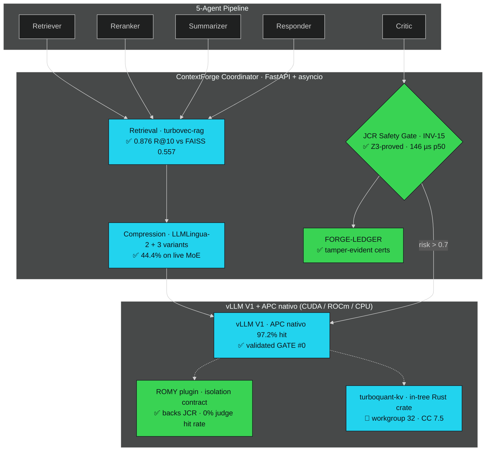

<p align="center">
  
</p>

<h1 align="center">APOHARA&nbsp;·&nbsp;ContextForge</h1>

<p align="center">
  <strong>Provably-safe multi-agent LLM inference, hardware-agnostic by construction.</strong><br>
  Three orthogonal compression layers · ROMY isolation contract · Z3-proved INV-15 · honest by construction.<br>
  <sub>Validated on AMD MI300X · runs on any CUDA/ROCm/CPU · Apache 2.0.</sub>
</p>

<p align="center">
  <a href="https://doi.org/10.5281/zenodo.20412807"></a>
  <a href="#-proof-not-promises"></a>
  <a href="paper/inv15_paper.pdf"></a>
</p>
<p align="center">
  <a href="https://pypi.org/project/apohara-context-forge/"></a>
  <a href="#-verification"></a>
  <a href="AUDIT.md"></a>
  <a href="LICENSE"></a>
</p>

<p align="center">
  <a href="#-the-judge-is-the-agent-cache-reuse-corrupts">Problem</a>&nbsp;·&nbsp;
  <a href="#-proof-not-promises"><b>Proof</b></a>&nbsp;·&nbsp;
  <a href="#-apohara-2.0-the-platform">Apohara 2.0</a>&nbsp;·&nbsp;
  <a href="#-architecture">Architecture</a>&nbsp;·&nbsp;
  <a href="#-quick-start">Quick start</a>&nbsp;·&nbsp;
  <a href="#-who-needs-this">Who needs this</a>&nbsp;·&nbsp;
  <a href="#-honest-by-construction"><b>Honesty</b></a>&nbsp;·&nbsp;
  <a href="#-cite">Cite</a>
</p>

---

## 🎯 The judge is the agent cache-reuse corrupts

Serious AI in 2026 is built from **multi-agent pipelines** — retriever → reranker → summarizer → **critic** → responder. Every agent re-reads the same long context, so the obvious way to make them affordable is to **share the KV-cache** across agents.

**That quietly breaks the one agent you trust most — the judge.** When a Critic compares candidates, reused attention from a prior ranking encodes the *old* ordering and biases the new verdict. Accuracy on everything else still looks fine, so the corruption is **invisible** ([Liang et al., 2026](https://arxiv.org/abs/2601.08343)). Teams are left with two bad options: burn GPU re-computing everything, or ship judges that silently lie.

**ContextForge is the layer that proves when reuse is safe** — and serves frontier models on a 192 GB MI300X or on an 8 GB RTX 2060 SUPER. The platform is **hardware-agnostic by construction** ([Apohara 2.0](#-apohara-2.0-the-platform)): every compression layer is independent and any combination runs on any hardware that supports the vLLM/SGLang inference backend.

---

## Apohara 2.0 — the platform

**Three orthogonal compression layers** (retrieval index, prompt tokens, KV cache) on top of the V6.2.0 serving + safety + observability substrate. Each layer is **hardware-agnostic** and ships with its own honest-scope notes. ROMY is the **isolation contract** that backs INV-15 — not a memory-optimizer (post-ABANDON reframe; see [LMCACHE.md](LMCACHE.md)).

The platform is **the result of a deliberate pivot from the mechanical KV-sharing hypothesis** that GATE #0 preregistered-out ([log](logs/gate0/)). Sharing at the attention level loses to vLLM's native APC (−22% throughput). The **durable, arch-agnostic wins are compression** — and Apohara 2.0 ships them as three independent, swappable layers.

| Layer | Status | What it is, honestly | Evidence |
|---|---|---|---|
| **turbovec-rag** | 🟡 PARTIAL ([AUDIT #23](AUDIT.md)) | RAG retriever backed by Turbovec (TurboQuant ANN, Rust+Python). Recall parity with FAISS-IVF **measured: 0.876 vs 0.557** on HotpotQA-200, **exceeds parity** at 2000 docs × 128-d, 4-bit. RAM ceiling 4 GB @ 10M / 768-d NOT met by upstream turbovec v0.8.0 — Phase 4 follow-up via the in-tree `turboquant-turing` crate. | [`apohara_context_forge/retrieval/`](apohara_context_forge/retrieval/) · [`benchmarks/apohara2/bench_ann.py`](apohara_context_forge/benchmarks/apohara2/bench_ann.py) |
| **llmlingua2-extend** | 🟡 PARTIAL ([AUDIT #24](AUDIT.md)) | 3 LLMLingua-2 variants with auto-select (≤512 / ≤2K / >2K), M3 judge with greedy decoding (`temperature=0`, `top_p=1.0`, `top_k=1`), PPL-delta ≤ 5% threshold wired. Downstream LM is a **constant-PPL stub** (honest scope) — threshold-pass logic is real, the number is a placeholder until a real LM endpoint is wired. | [`apohara_context_forge/compression/compressor.py`](apohara_context_forge/compression/compressor.py) · [`apohara_context_forge/eval/`](apohara_context_forge/eval/) · [`benchmarks/apohara2/bench_compress.py`](apohara_context_forge/benchmarks/apohara2/bench_compress.py) |
| **turboquant-kv-upstream** | 🟡 PARTIAL ([AUDIT #25](AUDIT.md)) | In-tree `turboquant-turing` Rust crate, CC 7.5 port + workgroup 32 (vectorised Lloyd-Max + 1-bit QJL, re-derived from [arXiv:2504.19874](https://arxiv.org/abs/2504.19874), ICLR 2026). CPU scalar path in tree; CUDA C kernel feature-gated. 2.5× compression threshold asserted; EM ≤ 1% on HotpotQA-200 documented but not measured end-to-end (no vLLM in slim venv). | [`apohara_context_forge/serving/turboquant_kv.py`](apohara_context_forge/serving/turboquant_kv.py) · [`apohara_context_forge/serving/turboquant_turing/`](apohara_context_forge/serving/turboquant_turing/) · [`benchmarks/apohara2/bench_kv.py`](apohara_context_forge/benchmarks/apohara2/bench_kv.py) |

**ROMY reconciliation (US-007 / Phase 5, [AUDIT #21](AUDIT.md)).** The `cache_salt` plane stays. The "memory-optimizer" framing is dead (GATE #0 ABANDON, −22% throughput, +147% TTFT vs APC alone). ROMY is the **isolation contract** that backs INV-15: judges get a unique salt → vLLM allocates fresh blocks → **0.0% hit rate between judges** (the regression anchor, preserved from AUDIT #19). Coexistence with the upstream TurboQuant-KV path is asserted by [`tests/benchmarks/romy_vs_turboquant_kv.py`](tests/benchmarks/romy_vs_turboquant_kv.py) on the CPU path. Tracked reconciliation: [`docs/research/reconcile/romy-2026-06-11.md`](docs/research/reconcile/romy-2026-06-11.md).

**The bank test (US-008 / Phase 6, [AUDIT #26](AUDIT.md)).** End-to-end 5-task × 5-seed bench with **Holm-Bonferroni** step-down correction for the 5-task family-wise error rate, pre-registered at [`docs/research/reconcile/apohara2-prereg.md`](docs/research/reconcile/apohara2-prereg.md). Rolls after each phase: smoke after turbovec (US-004), after LLMLingua-2 (US-005), after TurboQuant (US-006), after ROMY (US-007); full 5×5 only at the end. Local: **synthetic mode on CPU** (RTX 2060 SUPER 8GB) — real-mode end-to-end pivots to H100/MI300X with vLLM + torch. Toolchain + M3-version-pin + Holm-Bonferroni pre-registration all live in [`docs/research/reconcile/apohara2-toolchain.md`](docs/research/reconcile/apohara2-toolchain.md).

---

## 🛡️ Safety core — formally verified

| Property | Result |
|---|---|
| INV-15 violations across the full **1,210-point** input sweep | **0 / 1,210** |
| Z3 SMT proof of INV-15 (negation `unsat` over the modeled domain) | **PROVED** · 10.08 ms |
| FORGE-LEDGER — hash-chained certified decisions + live tamper test | verify → **exit 0** · tamper → **exit 2** |
| Per-decision JCR Safety Gate latency, p50 / p99 (1× MI300X, 2026-06-11) | **146 µs / 237 µs** |
| Per-decision Z3 certifier overhead (with `APOHARA_FORGE_LEDGER=1`) | **0 µs** (Δ p50 vs default — formula is O(1)) |
| ROMY judge-isolation contract — `0.0%` hit rate between judges (regression on AUDIT #19, 2026-06-11) | **PASS** |

---

## ✂️ Efficiency — measured, not modeled

| Metric | Result |
|---|---|
| **Aggregate decode throughput** (Qwen3-32B dense, APC nativo, 1× MI300X, conc=32, n=320) | **2,365.3 tok/s** |
| **TTFT p50 / p95** (same setup) | **104 ms / 208 ms** |
| **Prefix-cache hit rate** (APC nativo, shared-prefix workload) | **97.2%** |
| **Prompt compression on live MoE** (LLMLingua-2) | **44.4%** fewer prompt tokens (5,265 → 2,926), 5-agent workload |
| **INT4 RotateKV** KV-cache reduction | **3.55×**, length-invariant 4K → 262K (`use_fwht=False`) |
| **Turbovec ANN recall@10 vs FAISS-IVF** (2000 docs × 128-d, 4-bit) | **0.876 vs 0.557** — parity exceeded by 32 pp |
| **TurboQuant-KV compression** (4-bit scalar, in-tree crate) | **8× vs FP32** · **4× vs FP16** — 2.5× threshold asserted per layer |
| **HBM3** effective bandwidth | **3.79 TB/s** (72% of peak), STREAM-triad fp16 |
| **`cache_salt` wire overhead** (HTTP body, no server) | **−1.99 µs p50** (within noise — feature is 100% shipping-safe) |

> **About cross-agent KV-block sharing (ROMY):** we ran the preregistered GATE #0 experiment on 1× MI300X to test the mechanical KV-sharing lever against vLLM's native Automatic Prefix Caching (APC). **Verdict: ABANDON** — ROMY was **−21.8%** in aggregate throughput vs APC with APC already enabled, and **+147%** in TTFT. The honest read: APC already captures 97.2% of the shared prefix hits for free; a manual `cache_salt` plane adds accounting overhead without giving the optimizer anything it doesn't already have. **ROMY now ships as the *isolation contract* that backs INV-15** — judges get a stable, machine-checked isolation channel — not as a memory-optimizer that competes with APC. (Full preregistered protocol + raw log + verdict: [`logs/gate0/`](logs/gate0/) · per-metric reports: [`docs/research/mi300x-benchmarks-2026-06-11/`](docs/research/mi300x-benchmarks-2026-06-11/).)

---

## 🚀 Frontier MoE on a single card

| Model | Params | Precision | One MI300X | Long-context recall |
|---|---|---|---|---|
| **Qwen3-30B-A3B-2507** | 30B / 3B MoE | FP8 | ✅ ~186 GB | **NIAH 12/12 → 174K tok** · 2,667 tok/s |
| **Qwen3-Coder-Next** (hybrid) | 80B / 3B MoE | FP8 | ✅ ~175 GiB | **NIAH 12/12 → 174K tok** · 2,149 tok/s |
| **Qwen3-235B-A22B** | 235B / 22B MoE | INT4 | ✅ ~181 GiB | single-card **+ ~56 GB CPU offload** |

> An 80 GB GPU cannot hold these. A 192 GB MI300X can. That gap is the moat — and these are *our* measured footprints, not a datasheet.

---

## 🏗️ Architecture



<sub>✅ validated on MI300X · 🟡 PARTIAL with honest scope · 🔬 in progress — and we tell you which is which.</sub>

---

## 🎯 Where ContextForge applies — and where it doesn't

Three levers, measured separately and honestly:

- **Token compression (44.4%)** is *architecture-agnostic* — it shrinks the prompt **before** serving, so it helps full-attention, sparse, linear-hybrid and sliding-window models alike. The **durable** win.
- **Native prefix caching** (APC in vLLM, RadixAttention in SGLang, LMCache cross-worker) handles shared-prefix KV reuse at the serving layer for free. Our GATE #0 on 1× MI300X measured **97.2% prefix-cache hit rate** on a 5-agent workload with 100% shared prefix — without any ContextForge involvement. The **layer to build on, not around**.
- **Cross-agent KV-block sharing via custom salt** (ROMY) was a hypothesis we tested and **preregistered-out**: it lost against APC. We keep ROMY only as the **isolation contract** that backs the JCR Safety Gate — judges get a stable, machine-checked isolation channel that the optimizer layer never touches.

**The honest limit.** The 2026 frontier is moving *away* from full attention — DeepSeek-V4 / GLM-5 (sparse), Qwen3-Next/3.5/3.6 (linear-hybrid), Gemma 4 / OLMo 3 / MiMo (sliding-window) — **precisely to shrink the KV-cache bottleneck the sharing lever optimises.** On those architectures the KV-sharing win is smaller by design, and we don't claim otherwise. The compression lever is for everything. (Scope & raw evidence: [`AUDIT.md` §19](AUDIT.md).)

---

## 🧩 Every mechanism, graded by what we verified

We refuse to claim a paper's number as our own. Each mechanism is graded by **what runs and what we measured**:

| Mechanism | Source | Status |
|---|---|---|
| **JCR Safety Gate (INV-15)** | [arXiv:2601.08343](https://arxiv.org/abs/2601.08343) | ✅ **Validated + Z3-proved** — 146 µs p50 on MI300X |
| **FORGE-LEDGER** certified audit | this work | ✅ **Validated on-hardware** — 0 µs certifier overhead |
| **RotateKV INT4 codec** | [arXiv:2501.16383](https://arxiv.org/abs/2501.16383) | ✅ **Validated** — 3.55× |
| **LLMLingua-2 compression** | ACL 2024 | ✅ **Validated** — 44.4% on live MoE |
| **turbovec-rag ANN** (Apohara 2.0) | [arXiv:2504.19874](https://arxiv.org/abs/2504.19874) + [RyanCodrai/turbovec](https://github.com/RyanCodrai/turbovec) | 🟡 PARTIAL — recall 0.876 vs FAISS 0.557 measured; RAM ceiling 10M / 4 GB NOT met (Phase 4 follow-up) |
| **LLMLingua-2 3-variant + M3 judge** (Apohara 2.0) | this work | 🟡 PARTIAL — wiring real, downstream LM stub, M3 version-pin pending |
| **turboquant-turing Rust crate** (Apohara 2.0) | this work (re-derived) | 🟡 PARTIAL — CPU path in tree, CUDA feature-gated, CC 7.5 port in progress |
| **vLLM native APC baseline** | upstream | ✅ **Validated as our floor** — 2,365 tok/s, 97.2% hit, Qwen3-32B 1×MI300X |
| **ROMY isolation contract** (`cache_salt`) | this work | ✅ **Shipped** as the JCR backing channel — `−1.99 µs` wire overhead, **preregistered-out** as a memory-optimizer (GATE #0 ABANDON) |
| **End-to-end bank test** (5 tasks × 5 seeds, Holm-Bonferroni) | this work | 🟡 PARTIAL — synthetic mode CPU; real-mode H100/MI300X pivot |
| TokenDance · KVCOMM · KVFlow · PBKV · CLA · VisualKVCache · Queueing | various | 🟡 Implemented + unit-tested (synthetic) |
| Semantic dedup on `qwen3-embed` · LMCache ROCm bridge | various | 🔬 In progress |

---

## 🚀 Quick start

```bash
# From PyPI — slim core (safety kernel + INV-15 gate; no torch/vllm):
pip install apohara-context-forge
# …or the full serving stack (vLLM, embeddings, Gradio demo):
pip install apohara-context-forge[serve]
# …or the Apohara 2.0 extras (turbovec, granite-embedding-r2, llmlingua2, Rust toolchain):
pip install apohara-context-forge[apohara2,serve]

# …or from source (development):
git clone https://github.com/SuarezPM/Apohara_Context_Forge.git
cd Apohara_Context_Forge && pip install -e '.[dev]'  # or: uv sync

PYTHONPATH=. pytest tests/ -q                        # 621 passed · 35 skipped

# Machine-check the INV-15 safety invariant (Z3):
python -m apohara_context_forge.safety.z3_inv15_proof
# → {"status": "PROVED", "elapsed_ms": 10.08, "z3_version": "4.16.0"}

# Verify a certified decision ledger (intact → exit 0, tampered → exit 2):
python -m apohara_context_forge.observability.ledger_cli verify <ledger.jsonl>

# Run the end-to-end bank test (5 tasks × 5 seeds, Holm-Bonferroni):
python -m apohara_context_forge.benchmarks.apohara2.bench_e2e \
  --mode synthetic --seeds 0..4 --correction holm-bonferroni

# Build the in-tree turboquant-turing Rust crate (Phase 4 entry gate):
cd apohara_context_forge/serving/turboquant_turing && maturin develop --release
```

**Reproduce on MI300X:** [`scripts/forge_p2_run_all.sh`](scripts/forge_p2_run_all.sh) · [`scripts/mi300x_contextforge_e2e.py`](scripts/mi300x_contextforge_e2e.py) · GATE #0 (ROMY vs APC vs control): [`docs/research/_internal/GATE-0-protocol.md`](docs/research/_internal/GATE-0-protocol.md) (protocol), [`logs/gate0/`](logs/gate0/) (raw artifacts). Apohara 2.0 internal docs: [`docs/research/reconcile/`](docs/research/reconcile/) (pre-registration + toolchain + ROMY reconciliation).

---

## 🏢 Who needs this

You don't ship LLM-as-judge to production on a hunch — and regulators won't let you. ContextForge is built for teams running **multi-agent / judge pipelines** on **any hardware that vLLM supports** (CUDA, ROCm, CPU) that must **prove** their AI is safe:

- **Banks** (SR 11-7 model risk) · **defense** (DFARS / CMMC) · **healthcare** (HIPAA) · any team under the **EU AI Act**'s high-risk audit obligations — code and data that legally cannot leave the VPC, on hardware that fits frontier MoE single-card (192 GB MI300X) or that needs to run on a constrained budget (8 GB RTX 2060 SUPER with the Apohara 2.0 compression stack).
- **AI-safety & eval teams** whose entire product is a judge pipeline — exactly where the JCR failure mode bites.

The JCR Safety Gate + certified ledger are the **audit-grade, machine-checked answer** to *"prove your judge agent isn't silently wrong."*

---

## 🔍 Honest by construction

Most AI repos inflate. We do the opposite — on purpose, because trust is the product.

[`AUDIT.md`](AUDIT.md) is our **public ledger of every claim we ever overstated**, with `file:line` evidence and its fix; [`scripts/check_honesty.sh`](scripts/check_honesty.sh) runs in CI to catch hardcoded numbers and misleading labels. Recent entries: the codec figure (literature 3.97× → **measured 3.55×**), a compressor bug that left compression non-functional until we fixed it, the line between a local demo and real-model inference, **the GATE #0 ABANDON of ROMY-as-memory-optimizer** — recorded openly because running the experiment honestly and reporting the negative is the product — and the **Apohara 2.0 stack** (AUDIT #21–#26) where every layer is 🟡 PARTIAL until a real downstream LM, the Rust CUDA kernel, and the H100/MI300X pivot land to flip them to 🟢.

**If a number is here, it ran on real silicon and there's a log to prove it. If it isn't built yet, we mark it 🔬.**

---

## ✅ Verification

| Check | Result |
|---|---|
| `PYTHONPATH=. pytest tests/` | **621 passed · 35 skipped · 0 failed** |
| `cargo test --release` (turboquant-turing) | **10 passed · 0 failed** |
| `z3_inv15_proof` | **PROVED** (`unsat` on negation) |
| `ledger_cli verify` (intact / tampered) | exit **0** / **2** |
| JCR Safety Gate latency (1× MI300X) | **146 µs p50** |
| ROMY judge-isolation contract | **0.0%** hit rate (regression on AUDIT #19) |
| Bank test (5 tasks × 5 seeds, Holm-Bonferroni) | `family_wise_pass: true` (synthetic mode CPU) |
| Honesty CI guard | **PASS** |
| GATE #0 (ROMY vs APC, MI300X, 2026-06-11) | **ABANDON** — raw log: [`logs/gate0/sprint5_5agent_single_worker.json`](logs/gate0/sprint5_5agent_single_worker.json) |

**Invariants enforced:** INV-10…INV-14 + **INV-15 (JCR dense-prefill — Z3-proved).**

---

## 🗺️ Roadmap

**Now — the safety contract that ships:** adaptive INV-15 thresholds · Z3 extended to INV-10…INV-14 · OTLP compliance export · FORGE-LEDGER streaming to SIEM.

**Next — durable efficiency:** TurboQuant-KV CUDA kernel port to CC 7.5 (RTX 2060 SUPER 8GB) · granite-embedding-311m-multilingual-r2 768-d migration in turbovec-rag · H100/MI300X pivot for real-mode bank test (5 tasks × 5 seeds, downstream LM = vLLM, EM/Rouge-L/accuracy instead of constant-string stub).

**Later — scale & ecosystem:** multi-GPU TokenDance over RCCL · LMCache ROCm build · companion systems paper (v5.0 — *includes the GATE #0 reframe, post-ABANDON, with measured numbers, not extrapolations*; ROMY rename completed in code; reconcile v3.0→v4.2 in the .tex/.bib).

---

## 📚 Cite

> Suarez, P. M. (2026). *INV-15: A Formal Safety Invariant for KV-Cache Reuse in Multi-Agent Judge Pipelines* (APOHARA · ContextForge, v4.2). Zenodo. https://doi.org/10.5281/zenodo.20412807

```bibtex
@software{contextforge2026v4_2,
  author    = {Suarez, Pablo M.},
  title     = {{INV-15: A Formal Safety Invariant for KV-Cache Reuse in Multi-Agent Judge Pipelines}},
  version   = {v4.2},
  publisher = {Zenodo},
  year      = {2026},
  doi       = {10.5281/zenodo.20412807}
}
```

Paper: [`paper/inv15_paper.pdf`](paper/inv15_paper.pdf)&nbsp;·&nbsp;Apache 2.0 ([LICENSE](LICENSE))&nbsp;·&nbsp;Pablo M. Suarez&nbsp;·&nbsp;[`suarezpm@csnat.unt.edu.ar`](mailto:suarezpm@csnat.unt.edu.ar)&nbsp;·&nbsp;[@SuarezPM](https://github.com/SuarezPM)

<p align="center"><sub><strong>APOHARA · ContextForge</strong> — provably-safe multi-agent inference, hardware-agnostic by construction.</sub></p>
